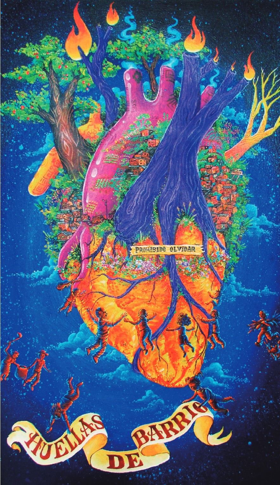
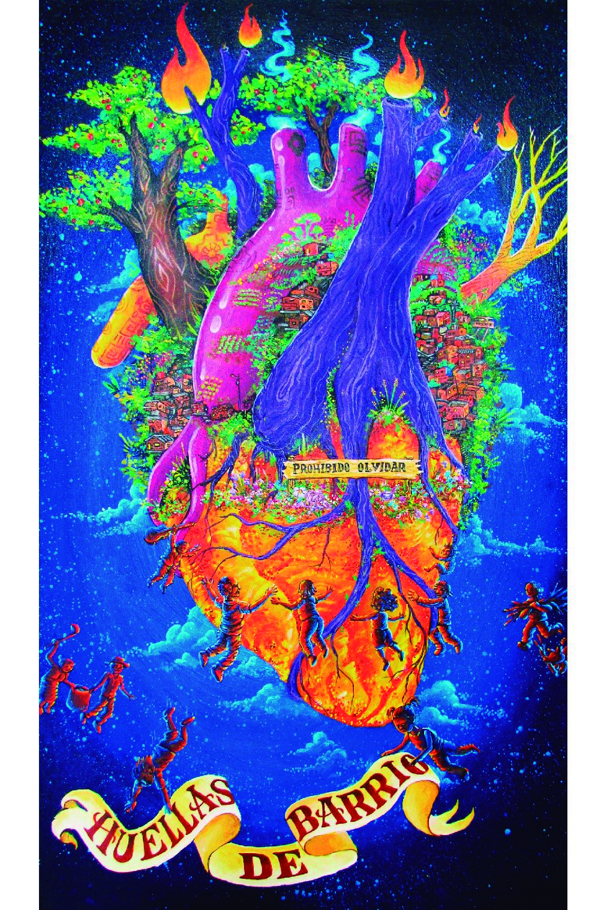

info procesos 

 

      <!-- Tarjetas -->

      

        

          

            Procesos
            <h1> Entre barrios populares  y favelas  </h1>

          

        

      

      

        <!--             inicio publicaciones -->
        

          <!-- card 1 -->
          

            

              

                
              

              <h4 class="text-center">
                2022 - Actual
                 
                CompartirES PopularES
              </h4>
              

                Proceso de investigación-acción-participación, con inicio en 2010, en el
                que han participado habitantes de barrios populares de Medellín, universidades de Medellín y brasileñas,
                servidores públicos del Parque Explora,
                del Sistema de Bibliotecas Públicas de Medellín y del Banco de la República, sede Medellín.
              

              

                <a href="../pages/proyecto-2022-compartires-populares.html" class="btn-pill ">Ver más</a>
              

            

          

          <!--         card 2 -->
          

            

              

                
              

              <h4 class="text-center">2018  
                Transformación de favelas
                en Río de Janeiro-Brasil
                y barrios populares
                de Medellín-Colombia
                por prácticas de turismo</h4>
              

                Se hace memoria de lo propio, se hace memoria de los lugares que sentimos propios,
                a veces nos quitan los lugares que nos pertenecen y nos imponen otros caminos, otros formas de habitar y
                es ejercicio personal y colectivo re-significar las formas de estar en lo nuevo.
              

              

                <a href="../pages/proyecto-2018-transformacion-favelas.html" class="btn-pill ">Ver más</a>
              

            

          

          

            

              

                
              

              <h4 class="text-center">2017   Sentipensar el barrio</h4>
              

                La descripción y espacialización de la memoria urbana de la población que habita el área de influencia
                de la intervención PUI-NOR, realizada en la centralidad de Santo Domingo Savio,
                comuna 1 del Municipio de Medellín (Colombia) entre 2004 y 2011
              

              

                <a href="../pages/proyecto-2017-sentipensar-barrio.html" class="btn-pill">Ver más</a>
              

            

          

          

            

              

                
              

              <h4 class="text-center">2016   La memoría se construye caminando</h4>
              

                La descripción y espacialización de la memoria urbana de la población que habita el área de influencia
                de la intervención PUI-NOR, realizada en la centralidad de Santo Domingo Savio,
                comuna 1 del Municipio de Medellín (Colombia) entre 2004 y 2011
              

              

                <a href="../pages/proyecto-2016-memoria-caminando.html" class="btn-pill">Ver más</a>
              

            

          

          

            

              

                
              

              <h4 class="text-center">2015  
                Barrios populares Medellín y favelas São Paulo</h4>
              

                La descripción y espacialización de la memoria urbana de la población que habita el área de influencia
                de la intervención PUI-NOR, realizada en la centralidad de Santo Domingo Savio,
                comuna 1 del Municipio de Medellín (Colombia) entre 2004 y 2011
              

              

                <a href="../pages/proyecto-2015-barrios-medellin-favelas-sp.html" class="btn-pill">Ver más</a>
              

            

          

          

            

              

                
              

              <h4 class="text-center">2014   Apropiación social del conocimiento</h4>
              

                Entendida como construcción social participativa y contextualizada en torno al conocimiento que
                permite a los sujetos que lo generan, reflexionar, aprehender, usar y potenciar sus saberes
                para la transformación positiva de su realidad (Gutiérrez, et al., 2014)
              

              

                <a href="../pages/proyecto-2014-apropiacion-conocimiento.html" class="btn-pill">Ver más</a>
              

            

          

        

        

          <a href="#" class="btn mt-4 m-auto "
            style="border: 2px solid ;background-color: #004200; color: white; border-radius: 30px;font-size: 30px;">Más
            publicaciones</a>
        

      

      <!-- Nueva Sección Popular-es dentro del contenedor de Barrios populares -->
      

        <!-- Decoraciones -->
        

      

      compartires pages

      <!-- 

          
          
          
 -->

          <!-- Modal para imagen Huellas de Barrio -->
    

      
  

        

          

            <h5 class="modal-title w-100 text-center fw-bold" id="hdbModalLabel">Video clip canción Huellas de Barrio</h3>
            <button type="button" class="btn p-0 m-0 border-0 bg-transparent position-absolute top-0 end-0" data-bs-dismiss="modal" aria-label="Cerrar" style="font-size:2.5rem;z-index:10;">
              <i class="fa-solid fa-xmark p-3" style="color:#949494;"></i>
            </button>
          

          

               <!-- video -->     
      <!-- 

        

          

            <iframe class="text-center w-100" style="height: 20vh; display: block; margin: auto; max-width: 80%;" src="https://www.youtube.com/embed/W9zla7jn9VU?list=RDW9zla7jn9VU&autoplay=1&mute=1&controls=1" title="YouTube video" frameborder="0" allow="accelerometer; autoplay; clipboard-write; encrypted-media; gyroscope; picture-in-picture" allowfullscreen> 
            </iframe>
          

        

      
 -->
      <!-- video -->
    

      

        

          <iframe class="text-center w-100 videoyt" style=" display: block; margin: auto; max-height: 80vh;"
            src="https://www.youtube.com/embed/W9zla7jn9VU?list=RDW9zla7jn9VU&autoplay=1&mute=1&controls=1"
            title="YouTube video" frameborder="0"
            allow="accelerometer; autoplay; clipboard-write; encrypted-media; gyroscope; picture-in-picture"
            allowfullscreen></iframe>
        

      

    

          

        

      

    
    

    ----------------------------------------------//----------------------------------------------------//--------------------------

    carousel

    

        

        

          

            

              <!-- Slide 1: cards 1,2,3 -->
              

                

                  

                    

                      

                        
                      

                      

                        <h5 class="card-title">David Dell</h5>
                        

                          Breve descripción o rol de la persona, acorde al
                          ejemplo visual mostrado.
                        

                        <a class="btn btn-primary btn-sm mt-2" href="#"
                          >View More</a
                        >
                      

                    

                  

                  

                    

                      

                        
                      

                      

                        <h5 class="card-title">Rose Bush</h5>
                        

                          Pequeña descripción que acompañe el título y el botón.
                        

                        <a class="btn btn-primary btn-sm mt-2" href="#"
                          >View More</a
                        >
                      

                    

                  

                  

                    

                      

                        
                      

                      

                        <h5 class="card-title">Jones Gail</h5>
                        

                          Texto corto explicativo sobre la tarjeta o persona.
                        

                        <a class="btn btn-primary btn-sm mt-2" href="#"
                          >View More</a
                        >
                      

                    

                  

                

              

              <!-- Slide 2: cards 2,3,4 -->
              

                

                  

                    

                      

                        
                      

                      

                        <h5 class="card-title">Rose Bush</h5>
                        

                          Pequeña descripción que acompañe el título y el botón.
                        

                        <a class="btn btn-primary btn-sm mt-2" href="#"
                          >View More</a
                        >
                      

                    

                  

                  

                    

                      

                        
                      

                      

                        <h5 class="card-title">Jones Gail</h5>
                        

                          Texto corto explicativo sobre la tarjeta o persona.
                        

                        <a class="btn btn-primary btn-sm mt-2" href="#"
                          >View More</a
                        >
                      

                    

                  

                  

                    

                      

                        
                      

                      

                        <h5 class="card-title">Person 4</h5>
                        
Descripción de la tarjeta 4.

                        <a class="btn btn-primary btn-sm mt-2" href="#"
                          >View More</a
                        >
                      

                    

                  

                

              

              <!-- Slide 3: cards 3,4,1 -->
              

                

                  

                    

                      

                        
                      

                      

                        <h5 class="card-title">Jones Gail</h5>
                        

                          Texto corto explicativo sobre la tarjeta o persona.
                        

                        <a class="btn btn-primary btn-sm mt-2" href="#"
                          >View More</a
                        >
                      

                    

                  

                  

                    

                      

                        
                      

                      

                        <h5 class="card-title">Person 4</h5>
                        
Descripción de la tarjeta 4.

                        <a class="btn btn-primary btn-sm mt-2" href="#"
                          >View More</a
                        >
                      

                    

                  

                  

                    

                      

                        
                      

                      

                        <h5 class="card-title">David Dell</h5>
                        

                          Breve descripción o rol de la persona, acorde al
                          ejemplo visual mostrado.
                        

                        <a class="btn btn-primary btn-sm mt-2" href="#"
                          >View More</a
                        >
                      

                    

                  

                

              

              <!-- Slide 4: cards 4,1,2 -->
              

                

                  

                    

                      

                        
                      

                      

                        <h5 class="card-title">Person 4</h5>
                        
Descripción de la tarjeta 4.

                        <a class="btn btn-primary btn-sm mt-2" href="#"
                          >View More</a
                        >
                      

                    

                  

                  

                    

                      

                        
                      

                      

                        <h5 class="card-title">David Dell</h5>
                        

                          Breve descripción o rol de la persona, acorde al
                          ejemplo visual mostrado.
                        

                        <a class="btn btn-primary btn-sm mt-2" href="#"
                          >View More</a
                        >
                      

                    

                  

                  

                    

                      

                        
                      

                      

                        <h5 class="card-title">Rose Bush</h5>
                        

                          Pequeña descripción que acompañe el título y el botón.
                        

                        <a class="btn btn-primary btn-sm mt-2" href="#"
                          >View More</a
                        >
                      

                    

                  

                

              

            

            <!-- Controls -->
            <button
              class="carousel-control-prev"
              type="button"
              data-bs-target="#cardsCarouselCustom"
              data-bs-slide="prev"
              aria-label="Anterior"
            >
              <i class="fa fa-angle-left ctrl-icon" aria-hidden="true"></i>
              Anterior
            </button>
            <button
              class="carousel-control-next"
              type="button"
              data-bs-target="#cardsCarouselCustom"
              data-bs-slide="next"
              aria-label="Siguiente"
            >
              <i class="fa fa-angle-right ctrl-icon" aria-hidden="true"></i>
              Siguiente
            </button>

            <!-- Indicators centered -->
            

              <button
                type="button"
                data-bs-target="#cardsCarouselCustom"
                data-bs-slide-to="0"
                class="active"
                aria-current="true"
              ></button>
              <button
                type="button"
                data-bs-target="#cardsCarouselCustom"
                data-bs-slide-to="1"
              ></button>
              <button
                type="button"
                data-bs-target="#cardsCarouselCustom"
                data-bs-slide-to="2"
              ></button>
              <button
                type="button"
                data-bs-target="#cardsCarouselCustom"
                data-bs-slide-to="3"
              ></button>
            

          

        

      

      ----------------------------------//--------------------------------------------------//-------------------------------------

<!-- imagenes de presentacion  -->
      

              
            
